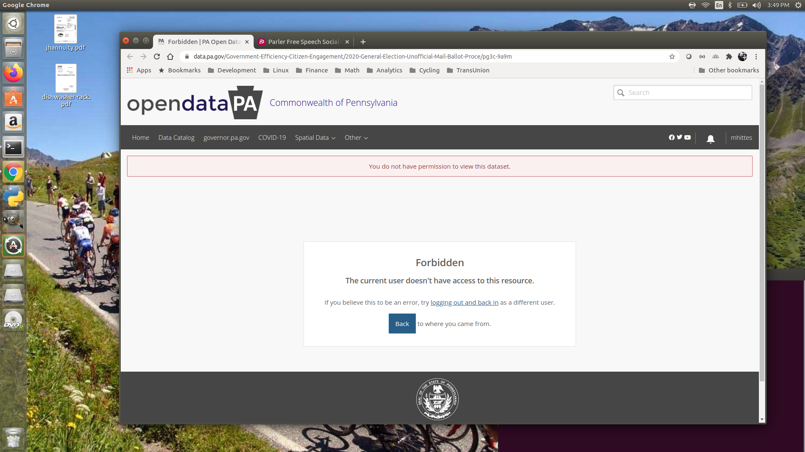

```{r setup, include=FALSE}
library(DBI)
library(dplyr)
library(sparklyr)
library(tibble)
library(corrr)
library(ggplot2)
library(dbplot)
library(lubridate)

sc <- spark_connect(master = "local", version = "2.4.3")

knitr::opts_chunk$set(echo = TRUE)
```

# **1. Introduction**

# **2. Pennsylvania mail-in ballots**

[source: opendataPA CommonWealth of Pennsylvania](https://data.pa.gov/Government-Efficiency-Citizen-Engagement/2020-General-Election-Mail-Ballot-Requests-Departm/mcba-yywm)

**NOTE:** This data is no longer publicly available. Access has been blocked with no explanation. Could it be that the data has been useful in identifying instances of fraud in certain Pennsylvania counties? What do the election authorities in Pennsylvania have to hide??

Fortunately, I downloaded this data shortly after the 11/4/2020 election and can be found in the 'data' directory of this project.



```{r echo=FALSE}
mail_ballot_requests <- spark_read_csv(sc, "data/2020_General_Election_Mail_Ballot_Requests_Department_of_State.csv")
```

## Sample data (10 records):

```{r}

mail_ballot_requests %>% sample_n(10)

```
## Number of mail-in ballots by party affiliation

This query shows the number of mail-in ballots by party designation (Republican or Democrat) and county.

**NOTE:** Third party ballots have been excluded

```{r}

mail_ballot_requests %>% filter(Applicant_Party_Designation %in% c('R', 'D')) %>% count(County_Name, Applicant_Party_Designation, sort = TRUE) 

```
## Number of ballots requested in Allegheny county by age

The birth date of 1/1/1800 is used to protected the privacy of certain registered voters (i.e. age = 220)

```{r}

mail_ballot_requests %>% filter(County_Name == 'ALLEGHENY') %>% mutate(Age = floor(datediff(current_date(), to_date(Date_of_Birth, 'MM/dd/yyyy'))/365.25)) %>% group_by(Age) %>% tally() %>% arrange(desc(Age))

```
```{r}

mail_ballot_requests %>% filter(County_Name == 'PHILADELPHIA') %>% mutate(Age = floor(datediff(current_date(), to_date(Date_of_Birth, 'MM/dd/yyyy'))/365.25)) %>% group_by(Age) %>% tally() %>% arrange(desc(Age))

```


```{r}

mail_ballot_requests %>% filter(County_Name == 'ALLEGHENY') %>% mutate(Age = floor(datediff(current_date(), to_date(Date_of_Birth, 'MM/dd/yyyy'))/365.25)) %>% filter(Age > 92 && Age < 221) %>% select(Age, Application_Approved_Date, Application_Return_Date, Ballot_Mailed_Date, Ballot_Returned_Date) %>% arrange(Age)

```

```{r}
mail_ballot_requests %>% filter(County_Name == 'ALLEGHENY') %>% mutate(Age = floor(datediff(current_date(), to_date(Date_of_Birth, 'MM/dd/yyyy'))/365.25)) %>% filter(Age > 99 && Age < 221) %>% count()
```

```{r}

mail_ballot_requests %>% filter(County_Name == 'ALLEGHENY') %>% mutate(Ballot_Turnaround_Days = datediff(to_date(Ballot_Returned_Date, 'MM/dd/yyyy'), to_date(Ballot_Mailed_Date, 'MM/dd/yyyy'))) %>% pull(Ballot_Turnaround_Days) %>% hist(main = "Histogram of Ballot Turnaround Days for Allegheny County, PA", xlim = c(0, 50), las=1)

```


```{r}

mail_ballot_requests %>% filter(County_Name == 'PHILADELPHIA') %>% mutate(Ballot_Turnaround_Days = datediff(to_date(Ballot_Returned_Date, 'MM/dd/yyyy'), to_date(Ballot_Mailed_Date, 'MM/dd/yyyy'))) %>% pull(Ballot_Turnaround_Days) %>% hist(main = "Histogram of Ballot Turnaround Days for Philadelphia County, PA", xlim = c(0, 50), las=1)

```
```{r}

mail_ballot_requests %>% filter(County_Name == 'ALLEGHENY') %>% filter(Applicant_Party_Designation %in% c('R', 'D')) %>% count(Applicant_Party_Designation) %>% collect()

```


```{r}

mail_ballot_requests %>% filter(Applicant_Party_Designation %in% c('R', 'D','IND')) %>% mutate(Ballot_Turnaround_Days = datediff(to_date(Ballot_Returned_Date, 'MM/dd/yyyy'), to_date(Ballot_Mailed_Date, 'MM/dd/yyyy')), Age = floor(datediff(current_date(), to_date(Date_of_Birth, 'MM/dd/yyyy'))/365)) %>% filter(Ballot_Turnaround_Days <= 1) %>% group_by(Applicant_Party_Designation) %>% summarise(n = count(), avg_age = round(mean(Age)))

```

```{r}
mail_ballot_requests %>% mutate(Ballot_Turnaround_Days = datediff(to_date(Ballot_Returned_Date, 'MM/dd/yyyy'), to_date(Ballot_Mailed_Date, 'MM/dd/yyyy'))) %>% filter(Ballot_Turnaround_Days <= 2) %>% count(County_Name, sort = TRUE)
```
```{r}
mail_ballot_requests %>% mutate(Ballot_Turnaround_Days = datediff(to_date(Ballot_Returned_Date, 'MM/dd/yyyy'), to_date(Ballot_Mailed_Date, 'MM/dd/yyyy'))) %>% filter(Ballot_Turnaround_Days <= 2) %>% mutate(Age = floor(datediff(current_date(), to_date(Date_of_Birth, 'MM/dd/yyyy'))/365))
```

```{r}
mail_ballot_requests %>% filter(County_Name %in% c('PHILADELPHIA', 'ALLEGHENY', 'LEHIGH', 'CHESTER', 'MONTGOMERY')) %>% mutate(Ballot_Turnaround_Days = datediff(to_date(Ballot_Returned_Date, 'MM/dd/yyyy'), to_date(Ballot_Mailed_Date, 'MM/dd/yyyy'))) %>% filter(Ballot_Turnaround_Days <= 1) %>% mutate(Age = floor(datediff(current_date(), to_date(Date_of_Birth, 'MM/dd/yyyy'))/365)) %>% ggplot(aes(x = Age)) + geom_histogram()
```

```{r}

mail_ballot_requests %>% mutate(Ballot_Turnaround_Days = datediff(to_date(Ballot_Returned_Date, 'MM/dd/yyyy'), to_date(Ballot_Mailed_Date, 'MM/dd/yyyy'))) %>% group_by(County_Name) %>% summarise(q25 = percentile(Ballot_Turnaround_Days, .25), mean = mean(Ballot_Turnaround_Days), q75 = percentile(Ballot_Turnaround_Days, .75), iqr = (percentile(Ballot_Turnaround_Days, .75) - percentile(Ballot_Turnaround_Days, .25)), sd = stddev(Ballot_Turnaround_Days)) %>% arrange(County_Name)

```


```{r}

mail_ballot_requests %>% filter(County_Name == 'ARMSTRONG') %>% mutate(Ballot_Turnaround_Days = datediff(to_date(Ballot_Returned_Date, 'MM/dd/yyyy'), to_date(Ballot_Mailed_Date, 'MM/dd/yyyy'))) %>% pull(Ballot_Turnaround_Days) %>% hist(main = "Histogram of Ballot Turnaround Days for Armstrong County, PA", xlim = c(0, 50), las=1)

```

```{r}

mail_ballot_requests %>% filter(County_Name == 'BLAIR') %>% mutate(Ballot_Turnaround_Days = datediff(to_date(Ballot_Returned_Date, 'MM/dd/yyyy'), to_date(Ballot_Mailed_Date, 'MM/dd/yyyy'))) %>% pull(Ballot_Turnaround_Days) %>% hist(main = "Histogram of Ballot Turnaround Days for Blair County, PA", xlim = c(0, 50), las=1)

```

```{r}

mail_ballot_requests %>% filter(County_Name %in% c('CHESTER', 'MONTGOMERY', 'CUMBERLAND', 'LANCASTER')) %>% transmute(County_Name = County_Name, Ballot_Turnaround_Days = datediff(to_date(Ballot_Returned_Date, 'MM/dd/yyyy'), to_date(Ballot_Mailed_Date, 'MM/dd/yyyy'))) %>% ggplot(aes(x = Ballot_Turnaround_Days)) +
  geom_histogram(bins = 20, na.rm = TRUE) +
  facet_wrap(~ County_Name)
```
